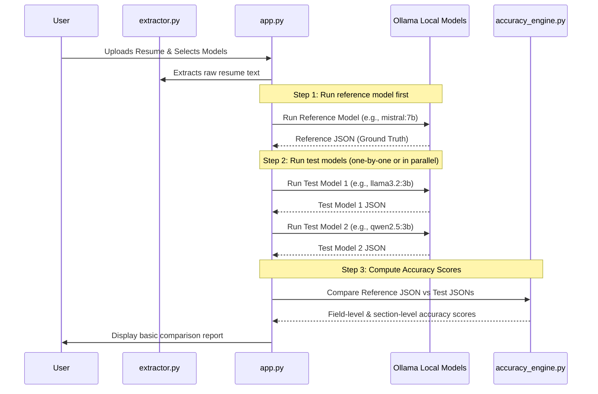

# Accuracy Measurement System — Focused Implementation Plan

This plan focuses exclusively on building a basic accuracy benchmark system for comparing SLM model performance against a reference model on a single resume.

---

## 1. Core Execution Flow

---

## 2. Step-by-Step Implementation

### Step 1: Reference Model Execution (Baseline)
1. The user picks one model to act as the **reference/benchmark model** (typically the largest local model, like `mistral:7b`).
2. Main app runs this model first to obtain the baseline JSON profile (`ResumeParserResponse`).
3. This baseline is stored as the absolute ground truth for the session.

### Step 2: Test Models Execution
1. The user selects one or more **test models** (smaller SLMs, like `llama3.2:3b` or `qwen2.5:3b`) to compare.
2. The app runs these test models on the exact same extracted resume text.
3. **Execution Strategy:** 
   * **Initial Approach:** Run them sequentially to keep resource utilization low (especially on local machines with limited GPU memory).
   * **Alternative (Advanced):** Run them in parallel using python threads if your machine has sufficient RAM/VRAM to handle multiple concurrent local models.

### Step 3: Compare & Calculate Accuracy Scores (`accuracy_engine.py`)
Create a python module `accuracy_engine.py` to compare a test model's JSON structure to the reference JSON structure.

#### Scoring Rules for Pydantic Schema Fields:
*   **Exact Values (Strings/Numbers):**
    *   *Fields:* `first_name`, `last_name`, `email`, `phone_number`, `location`, `linkedin_url`, `github_url`, `portfolio_url`, `gpa`
    *   *Rule:* 1.0 if both match exactly (case-insensitive, whitespace trimmed), otherwise 0.0.
*   **List Items (Strings):**
    *   *Fields:* `programming_languages`, `frameworks_and_tools`, `soft_skills`, `responsibilities`, `technologies_used`
    *   *Rule:* Use **Jaccard Similarity** index to calculate intersection over union:
        $$\text{Score} = \frac{|A \cap B|}{|A \cup B|}$$
        *(e.g., if Reference has 4 languages and Test has 3 of those 4 languages, score is 3/4 = 0.75).*
*   **Complex Nested Lists (Objects):**
    *   *Fields:* `work_experience`, `education`, `certifications`, `projects`
    *   *Rule:* Match list items by index or primary key (e.g., match `WorkExperience` items by `company_name`) and average the attribute scores of the matched objects.

---

## 3. Step 4: Streamlit UI Integration (Basic)

*   **Model Selection:** Update sidebar or top section to include:
    1. A single selectbox: **"Reference Model"** (defaulting to mistral).
    2. A multi-select box: **"Test Models to Compare"** (defaulting to the remaining models).
*   **Result Table:** Below the uploader, display a simple side-by-side dataframe comparison showing:
    *   Model Name
    *   Total Latency (seconds)
    *   Overall Accuracy Score (%)
    *   Breakdown scores per section (Personal Info, Skills, Experience, Education, Certifications, Projects).
